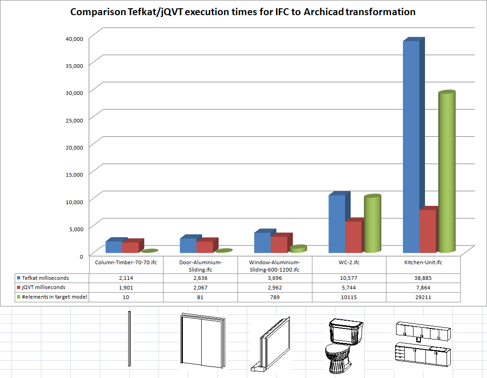

# raas4emf

This tool set - Repository as a Service (RaaS) for EMF - consists of three parts:

1. The RAAS generator that takes an EMF metamodel and generates JAXB annotations (in the opened .genmodel editor, choose "Augment EMF code with JAXB annotations").

2. A basic RAP-based HTML5 user interface to a model repository of a simple file/directory structure - called RaaSCMS - to allow uploads of repository contents via files that can be parsed into EMF models. The RaaSCMS UI allows for the stored models to be browsed at the high level by the CMS tree, and for each model uploaded to be browsed using the standard EMF tree viewer. 

3. jQVT - a Java code generator which uses the structure of the MOF QVT specification to specify relations between Java and EMF object types, and create output instances from a set of input instances by matching Java expressions used as predicates.

The jQVT update site is at https://raw.githubusercontent.com/patins1/raas4emf/master/plugins/org.eclipse.jqvt.updatesite and contains also the RaaS generator.

The RAP interface is here: http://custom-env-1.prh6d53tf2.ap-southeast-2.elasticbeanstalk.com/ui

The OCL demo is here: http://custom-env-1.prh6d53tf2.ap-southeast-2.elasticbeanstalk.com/restexample/plugin/org.raas4emf.restexample/WebContent/ocl.html

The FHIR demo is here: http://custom-env-1.prh6d53tf2.ap-southeast-2.elasticbeanstalk.com/fhirrest/plugin/org.fhir4emf.rest/WebContent/fhirtransform.html

The IFC domain with its huge model / metamodel sizes was the main trigger for the jQVT project:

